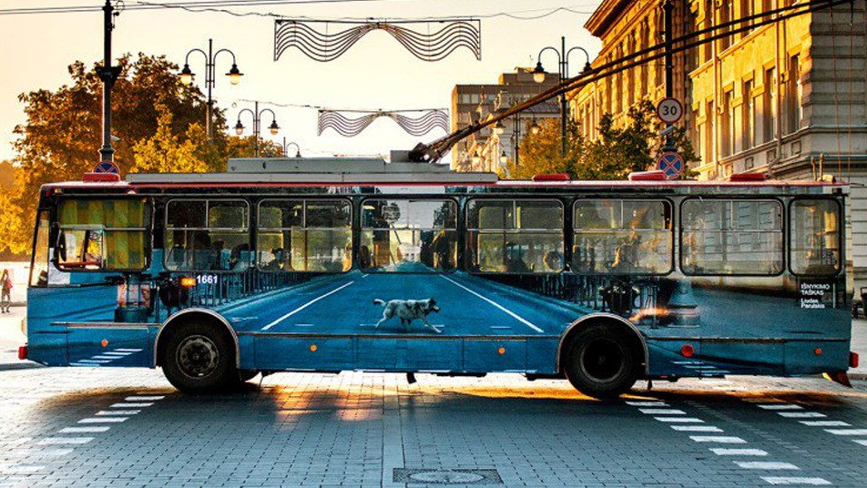

# [Urbanistas](https://www.urbanistas.lt)

### Apie ką šis blogas?

Apie miestus, jų gyvenimą, žmones ir technologijas kurie keičia visuomenę ir jos erdvę.

### Kodėl tai yra svarbu?

Aplinka turi didelę įtaką žmogaus gyvenimui. Nuo miesto priklauso ant kiek visuomenė yra integruota į jo gyvenimą, kaip yra patogu "naudotis" miestu tiek jo gyventojams, tiek ir atvykstantiems svečiams. Kaip padaryti taip, kad miestas būtų patrauklus, ekonomiškai efektyvus ir patogus gyventi.

### Gerai, o kaip tai galima pritaikyti Lietuvos miestuose?

Lietuvos miestai turi savo išskirtinį kelią. Tai kas veikia Olandijoje ar Vokietijoje, ne visada gali pritapti ir mūsų šalyje, tai gali įtakoti skirtingi faktoriai - kultūra, teisinė ir politinė sistema, klimatas ir kita. Tiesioginis idėjos panaudojimas - "padarykime kaip Amsterdame/Paryžiuje/Londone" - nelabai veikia. Todėl šio blog'o straipsniai labiau naudojami įkvėpimui, o ne tiesioginiam kopijavimui.

